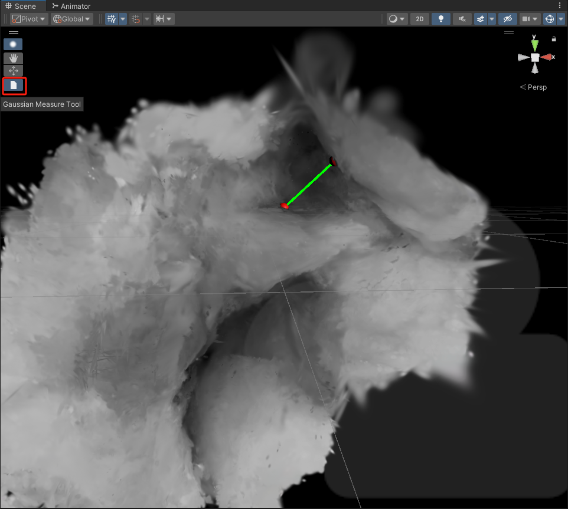
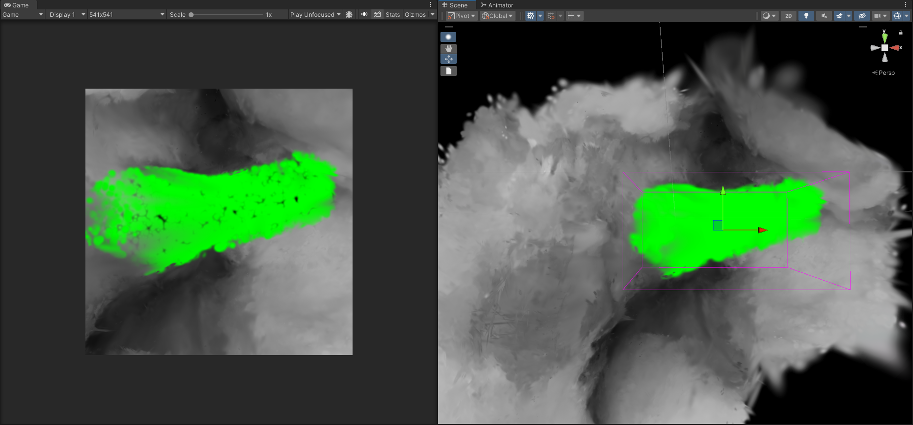
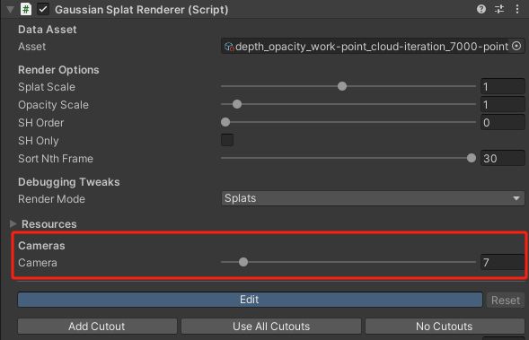

# arthro_AR

Aiming at enhancing intra-operative awareness of surgeons, we present an advanced pipeline to reconstruct realistic
intraarticular structures solely with monocular arthroscope video with recently emerging
3D Gaussian Splatting. Additionally, we offer Augmented Reality assistance for articular
notch measurement and annotation anchoring in a human-in-the-loop manner.

# Demo


## Installation
There are few submodules as dependencies of this project, refer to the installation process for each submodule listed below.
- our [OneSLAM](https://github.com/Soooooda69/OneSLAM_Arthro.git) to obtain sparse 3D priors.
- Pseudo [ monocular depth](https://github.com/Soooooda69/depth_anything.git) generation.
- [3D GS-based](https://github.com/Soooooda69/gaussian_surfels.git) reconstruction and realistic rendering. 
- [AR applications](https://github.com/Soooooda69/UnityGaussianSplatting.git) based on Unity (On Windows).

Any other scripts in the main folder, please use conda environment created for [OneSLAM](https://github.com/Soooooda69/OneSLAM_Arthro.git).

## Dataset Structure

To run on your data for reconsturction, setup a directory as follows

```
└── data
    └── subfolder
        ├── trial_1
           ├── images
           │   ├── 0.jpg
           │   ├── 1.jpg
           │   ├── 2.jpg
           │   └── ...
           ├── cam_params
               ├── calibration.json
               └── distortion_coeff.json
           ├── [mask.bmp]
           ├── [poses_gt.txt]
           └── [timestamp.txt]
```
For AR applications, data directory is as follows
```
└── data
    └── key_images
    │   ├── 0.jpg
    │   ├── 1.jpg
    │   └── ...
    │    masks
    │    ├── mask_0.png
    │    ├── mask_1.png
    │    └── ...
    ├── [poses_pred.txt]
    └── [timestamp.txt]
```

## Usage

First generate 3D priors of an arthroscopy footage.
```
 ./run_SLAM.sh
```
Change the trial name, data path and the start/end frame index accordingly. The SLAM results will be saved in 'output' folder. The image features, camera information and sparse point map will be saved in 'colmap_data' folder.

Next generate pseudo depth and perform scale recovery.
```
./depth_process.sh -n $TrialName
```
In 'disp' folder are the raw estimation of depth model, relative scale for depth maps are then recovered, and saved in 'depth' and 'depth_video' folder as npy and png. Based on the mono depth, normals are estimated and saved in 'normal' folder.

After getting the above information, the next step is to start 3D model training.
```
./run_SurfelTraining.sh -n $TrialName
```
3D GS model are trained and point cloud are save in 'gs_surfel' folder.

Alternatively, use the script to run full pipeline:
```
./full_pipeline.sh -n $TrialName
```

To evaluate the estimated camera trajectory, prepare a ground truth data and change the 'path' variable accordingly.
```
./evaluation/traj_eval.sh -p $YourPath 
``` 

For reconsturction accuracy evaluation, also prepare a ground truth 3D model and change the 'target' and 'source' path then run:
```
./run_eval.sh -n $TrialName
``` 
For [AR applications](https://github.com/Soooooda69/UnityGaussianSplatting.git), first follow the steps in the submodule to import the reconstructed 3D model. Click the sphere on top of the tool bar and choose the measurement tool at the bottom, then start measuring by choosing any two points on the 3D model.

To annotate interested region, first create mask of the region on the key images and save in 'masks' folder. In Unity interface, click the sphere on the tool bar, then press 'M' to highlight masked region. 
Adjust the camera slider to choose which key image to mask.
  
## License

This project is licensed under the [MIT License](LICENSE).


## Acknowledgment
We want to thank [OneSLAM](https://github.com/arcadelab/OneSLAM.git), [CoTracker](https://co-tracker.github.io/), [g2opy](https://github.com/uoip/g2opy),[Depth-Anything](https://github.com/LiheYoung/Depth-Anything.git), [Gaussian surfels](https://github.com/turandai/gaussian_surfels.git), [Gaussian object](https://github.com/lppllppl920/SAGE-SLAM) [depth-to-normal-translator](https://github.com/GaussianObject/GaussianObject.git) and [UnityGaussianSplatting](https://github.com/aras-p/UnityGaussianSplatting.git) for publicly releasing their code.
